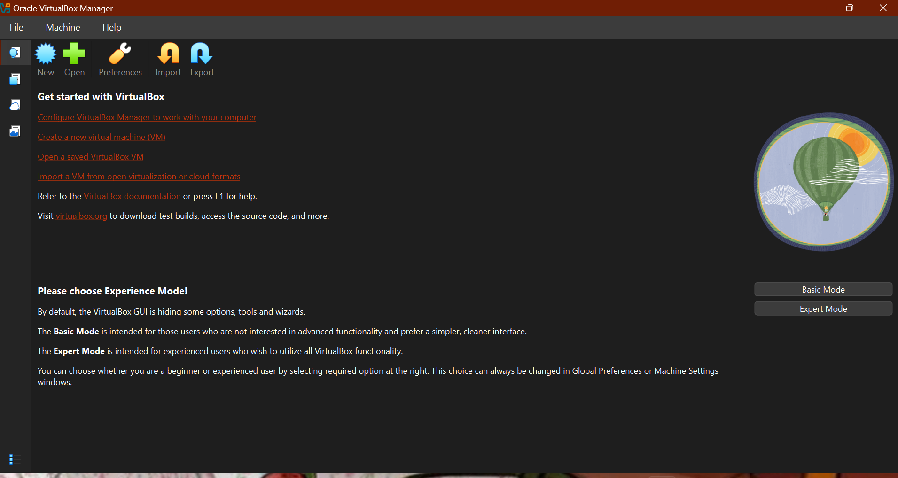
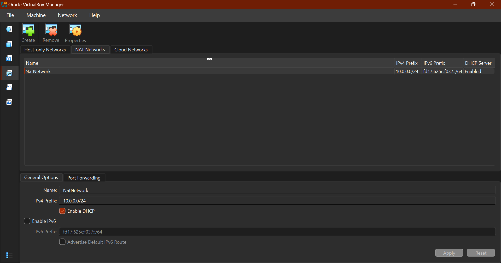
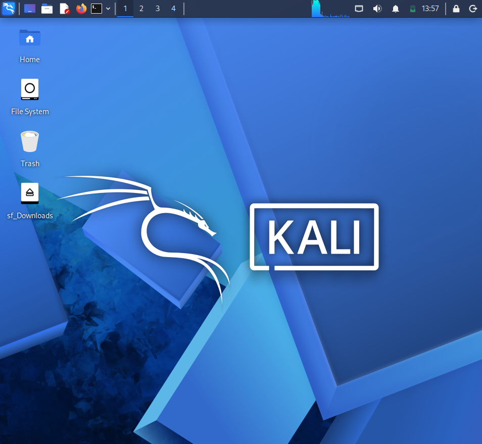
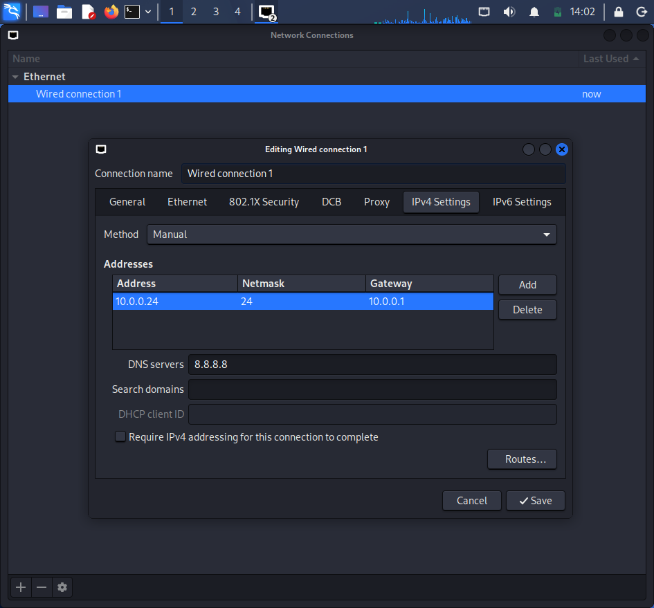

# 🔐 Cybersecurity Lab Environment Setup

**Setting up a virtual cybersecurity testing environment using VirtualBox and Kali Linux**

---

## 📌 Project Overview

This project involves setting up a virtual cybersecurity testing laboratory using **Oracle VirtualBox** and **Kali Linux**.

The purpose of the lab is to provide a controlled virtual environment for learning and practicing cybersecurity concepts, including network security, reconnaissance, vulnerability assessment, and other authorized security-testing activities.

The lab is configured on a dedicated **NAT Network using the 10.0.0.0/24 subnet**, with Kali Linux assigned the static IP address **10.0.0.2/24**.

The environment will also serve as the foundation for future cybersecurity projects and practical exercises.

---

## 🎯 Objectives

The main objectives of this project are to:

* Install 7-Zip for extracting virtual machine files.
* Install and configure Oracle VirtualBox.
* Create a NAT Network using the `10.0.0.0/24` subnet.
* Download and import Kali Linux into VirtualBox.
* Configure Kali Linux with the required IP address.
* Enable clipboard sharing and file drag-and-drop.
* Configure a shared `/downloads` folder between the host and Kali Linux.
* Ensure Kali Linux has full Internet access.
* Create a VM snapshot as a clean recovery point.
* Prepare the environment for future cybersecurity exercises.

---

## 🏗️ Lab Architecture

The cybersecurity lab consists of a Windows host machine running VirtualBox, with Kali Linux operating as the primary cybersecurity testing machine.

### Network Configuration

```text
Host Machine (Windows)
        │
        │
   Oracle VirtualBox
        │
        │
   NAT Network
   10.0.0.0/24
        │
        │
   Kali Linux VM
   10.0.0.2/24
```

The lab is designed to allow additional virtual machines to be added to the same network during future exercises.

---

## ⚙️ Lab Configuration

| Component                | Configuration     |
| ------------------------ | ----------------- |
| 🖥️ Host OS              | Windows           |
| 🧰 Hypervisor            | Oracle VirtualBox |
| 📦 VirtualBox Version    | 7.2.16-174877     |
| 🐉 Security/Attacking OS | Kali Linux        |
| 🌐 Virtual Network       | NAT Network       |
| 📡 Network Subnet        | `10.0.0.0/24`     |
| 🐉 Kali Linux IP         | `10.0.0.2/24`     |
| 📁 Shared Folder         | `/downloads`      |
| 📋 Clipboard Sharing     | Enabled           |
| 🖱️ File Drag & Drop     | Enabled           |
| 🌍 Internet Access       | Enabled           |

---

# 🪜 Lab Setup Procedure

## Step 1. Install 7-Zip

7-Zip was installed to allow compressed virtual machine files, including Kali Linux packages, to be extracted when required.

**Tool:** 7-Zip

---

## Step 2. Install VirtualBox

Oracle VirtualBox was installed as the virtualization platform for creating and managing the cybersecurity laboratory.

**Version used:**

```text
VirtualBox 7.2.16-174877
```


The host operating system used for this project is **Windows**.

---

## Step 3. Configure the NAT Network

A dedicated NAT Network was created in VirtualBox using the required subnet:

```text
Network: 10.0.0.0/24
```


The NAT Network provides a virtual networking environment where machines connected to the network can communicate with one another while still having access to external networks.

This configuration will allow additional target machines to be added to the lab during future cybersecurity exercises.

---

## Step 4. Download and Import Kali Linux

Kali Linux was downloaded and imported into VirtualBox as the attacking/security-testing machine.

The Kali Linux VM was connected to the previously created NAT Network.

The VirtualBox VM settings were also configured to support:

* Clipboard sharing
* File drag-and-drop
* Shared folders

A shared `/downloads` folder was configured to allow files to be transferred between the Windows host and the Kali Linux virtual machine.

The Kali Linux when fully configured looks like this: 

---

## Step 5. Configure the Kali Linux Network

Kali Linux was configured with the required IPv4 address:

```text
IP Address: 10.0.0.2
CIDR:       /24
```

The network configuration was then verified to ensure that the Kali Linux machine could communicate through the virtual network and access the Internet.

---

## Step 6. Create a VM Snapshot

After completing the initial configuration, a snapshot was created for the Kali Linux virtual machine.

The snapshot serves as a clean baseline that can be restored if future cybersecurity exercises modify the VM or cause configuration issues.

```text
VM
```

---

# 🔎 Lab Verification

The completed environment should be verified to ensure that the required configuration is working correctly.

| Test                  | Command / Check                | Expected Result         |
| --------------------- | ------------------------------ | ----------------------- |
| 🌐 Check IP address   | `ip a`                         | `10.0.0.2/24` displayed |
| 📡 Test network       | `ping <gateway>`               | Successful replies      |
| 🌍 Test Internet      | `ping 8.8.8.8`                 | Successful replies      |
| 🔎 Test DNS           | `ping google.com`              | Domain resolves         |
| 📁 Test shared folder | Access `/downloads`            | Folder accessible       |
| 📋 Test clipboard     | Copy/paste between host and VM | Successful              |
| 🖱️ Test drag & drop  | Transfer a test file           | Successful              |
| 📸 Verify snapshot    | Check VirtualBox snapshots     | Snapshot available      |

---

# 🐞 Problems Encountered & Solutions

## Slow Network During Kali Linux Download

The Kali Linux virtual machine took a considerable amount of time to download because of a slow Internet connection.

### Solution

I allowed the download to continue until completion and monitored the download rather than restarting it unnecessarily.

This highlighted the importance of having a stable network connection when working with large virtual machine images and cybersecurity lab environments.

---

# 💡 What I Learned

Through this project, I gained practical experience setting up a virtual environment for cybersecurity testing.

### 1. Virtualization

I learned how virtualization allows a complete operating system such as Kali Linux to run inside a virtual machine without replacing the host operating system.

### 2. Virtual Networking

I learned how to create and configure a NAT Network in VirtualBox and assign a specific private subnet to a virtual laboratory.

### 3. IP Addressing

I gained practical experience working with IPv4 addressing and CIDR notation, including configuring Kali Linux with:

```text
10.0.0.2/24
```

### 4. Virtual Machine Management

I learned how to configure VM settings, import an existing virtual machine, configure shared resources, and create snapshots.

### 5. Cybersecurity Lab Preparation

I learned that having a controlled and reproducible environment is important when performing cybersecurity experiments and security testing.

---

# 🔐 Security & Ethical Use

This laboratory is intended strictly for **educational purposes and authorized cybersecurity testing**.

All security-testing activities performed using this environment should only target systems that I own or have explicit permission to test.

The lab provides a controlled environment for learning cybersecurity concepts without intentionally targeting unauthorized systems.

---

# 🔗 Tools & Resources

* **7-Zip:** https://7-zip.org/download.html
* **Oracle VirtualBox:** https://virtualbox.org/wiki/Downloads
* **Kali Linux:** https://kali.org/get-kali

---

# 👤 Author

**Tijani Ayomide Tamunotonye**

Cybersecurity Intern / Trainee
**Network Walks — Cybersecurity Training**

---

## 📌 Project Information

|                |                                             |
| -------------- | ------------------------------------------- |
| **Program**    | Network Walks Cybersecurity Training        |
| **Week**       | Week 01                                     |
| **Project**    | Cybersecurity Testing Lab Environment Setup |
| **Primary VM** | Kali Linux                                  |
| **Hypervisor** | Oracle VirtualBox                           |
| **Network**    | `10.0.0.0/24`                               |
| **Kali IP**    | `10.0.0.2/24`                               |
| **Host OS**    | Windows                                     |

---

## 🚀 Future Expansion

As part of the next phase of the project, additional virtual machines may be added to the laboratory.

Potential future targets include:

* Windows 10/11
* Windows 7
* Android

These machines can be connected to the same virtual network and used for **authorized** cybersecurity testing, connectivity testing, and practical security exercises.

